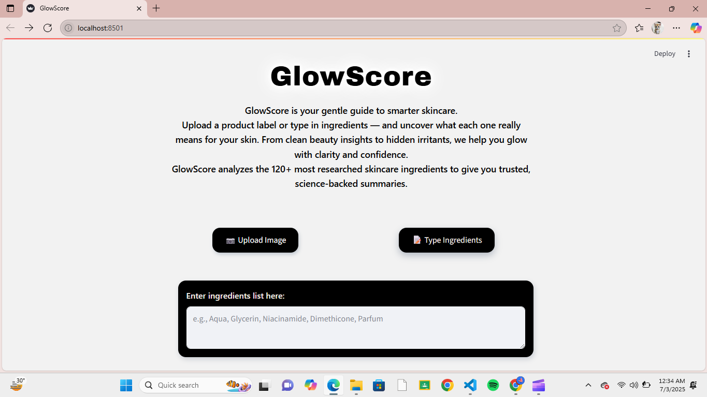

# GlowScore — Skincare Ingredient Analyzer

GlowScore is an AI-powered skincare analyzer that helps users determine whether a product is safe, effective, and compatible with their unique skin type. It’s a full-stack application that combines large language models (LLMs), optical character recognition (OCR), and real-world cosmetic ingredient data gathered from domain research to provide users with detailed skincare evaluations.

Link to the web-app: [https://glowscore-app.streamlit.app/](https://glowscore-app.streamlit.app/)  

(bug fixing yet to be done)

---

## Tech Stack
- Streamlit (UI & deployment)
- Python, Pandas, NumPy (logic)
- pytesseract (OCR)
- OpenAI GPT (ingredient cleanup & personalized advice)

---

## How It Works
1. Users either upload a skincare product label image or manually enter the ingredient list.
2. If an image is uploaded, OCR (pytesseract) extracts text, and GPT cleans it into a structured list.  
3. Ingredients are matched against a custom dataset of 140+ commonly used cosmetic components.
4. Based on the user’s skin quiz responses and the identified ingredients, the app generates:
   - A per-ingredient skin compatibility summary
   - An overall GlowScore rating reflecting safety and suitability
   - Personalized skincare advice tailored to the user’s skin type and concerns

---

## Optimizations
- Refined OCR pipeline using GPT for accurate ingredient extraction  
- Separate results page implementation for a smoother user experience  
- Boolean-based dataset for simplified logic and fast filtering

---

## Lessons Learned
- Integrated OCR and LLMs for intelligent text processing.
- Designed a real-world dataset for skincare analysis.
- Built a multi-input Streamlit app with result routing.
- Managed AI workflows, UI design, and deployment with system dependencies.

---

## Improvements Needed
- **Ingredient Matching Sensitivity**: Improve recognition of synonyms or alternate names (e.g., “BHA” vs. “Salicylic Acid”).
- **Error Handling for OCR Failures**: Add user-friendly messages or retry options when image quality causes OCR to fail.
- **Performance Optimization**: Speed up large inputs by batching GPT calls and optimizing data pipelines.
- **Skin Quiz Depth**: Expand quiz logic to include more user concerns like product preferences.
- **Mobile Responsiveness**: Further refine the layout for smaller screens to improve usability.
- **Ingredient Dataset Expansion**: Increase dataset size to include 500-1000 common skincare ingredients for more complete evaluations.
- **UI Improvement**: Add loading indicators and smoother transitions to enhance user experience during processing.
  
